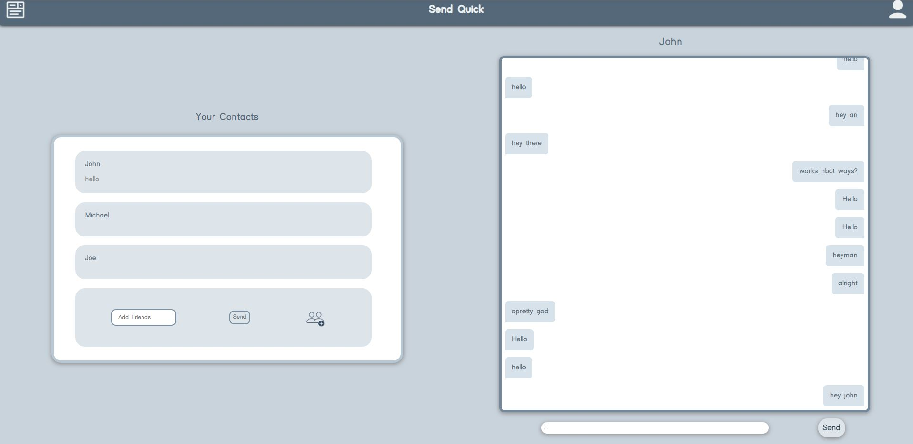
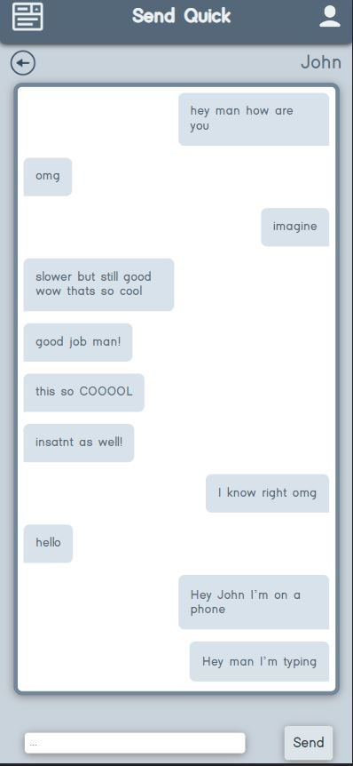
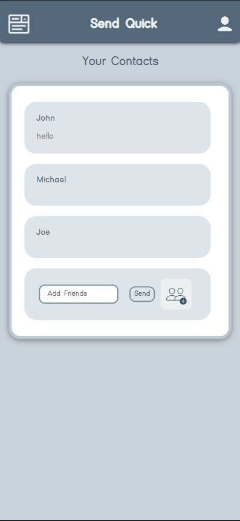

# **Quick Send Instant Messaging Application**

### Carl Menke

### 9/26/2022

#### [GitHub](https://github.com/carlmenke) | [LinkedIn](https://www.linkedin.com/in/carl-menke-333226139/)

---

## **_Description_**

This is a full CRUD browser-based instant messaging application in React Redux, postgreSQL, Express.js, and Node.js which I coded in 8 days two weeks after being introduced to these languages.

### **_Features_**

Usilizing Socket.io this Application demonstrates many of the same features as the most popular messaging applications.

 - Instant messaging, the message you send will appear on your friends screen with out the need for them to refresh their page.
 - Instant friend Request, When you send a friend request to a friend they will be prompted immediately with a choice to accept or deny that request.
 - Current typing, you will see a bubble if the friend you are messaging is typing.
 - View most recent messages, when viewing all of your contacts you can see the most recent and updated message they have sent to you.

---

## **_Screenshots_**

### Final Application Screenshots Optimized For Desktop:

### Final Application Screenshots Optimized For Desktop:

---

## **_Technologies_**

- React.js
- React-Redux
- postgreSQL
- sequelize
- Express.js
- Node.js
- Javascript

---

## **_Roadmap (Future Updates)_**

- ~~Add Games Typing Feature~~
- ~~Deploy on Heroku~~
- Add Games Page
- Add Clicking Competitiion Game
- Add Connect 4
- Further Optimize for mobile
- Add Calling

---

## **_Getting Started_**

### [Send Quick](https://sendquick.herokuapp.com/)

The Entity Relationship Diagram and Component Hierarchy Diagram I used to develop this application can be found on my **[Trello Board](https://trello.com/b/frwIGzFS/send-quick)**

1. Click on the icon in the top right to sign up or log in.
2. Search for a friend of yours using the add friend button.
3. Click on thier contact name to view your messages with the respective friend.

---

## **_Credits_**

**PNG ICONS:** [Icons](https://icons8.com/)

